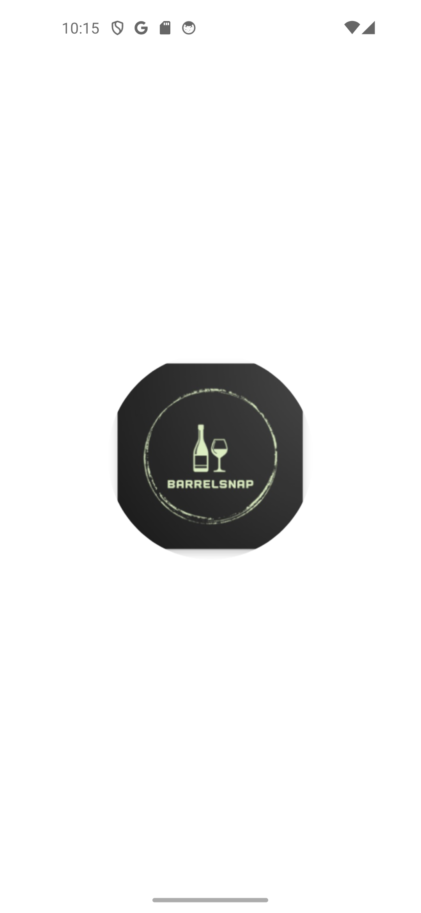
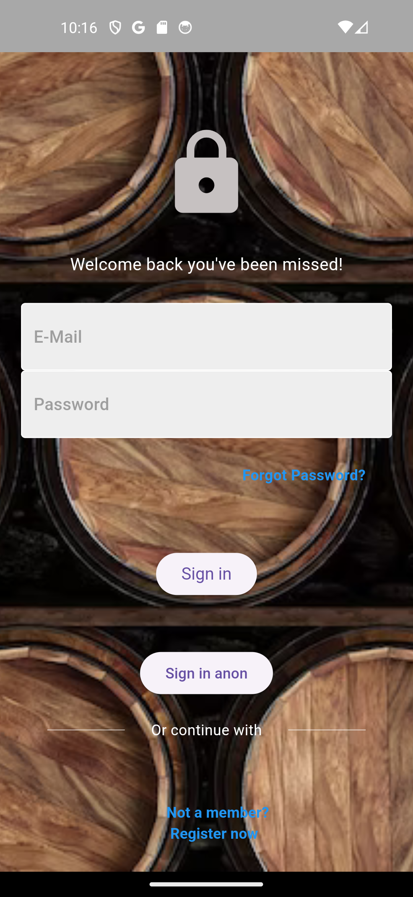
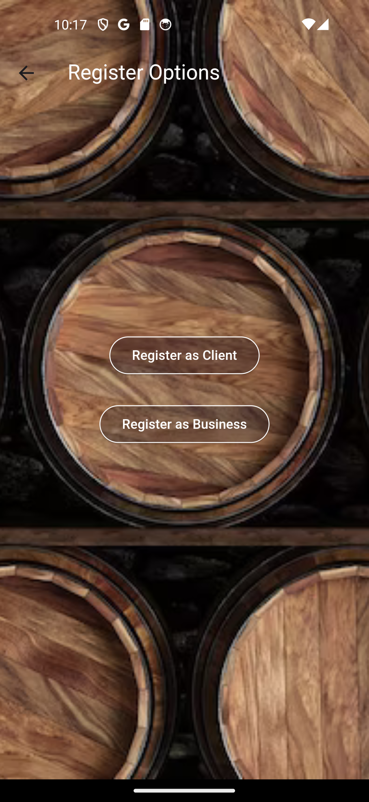
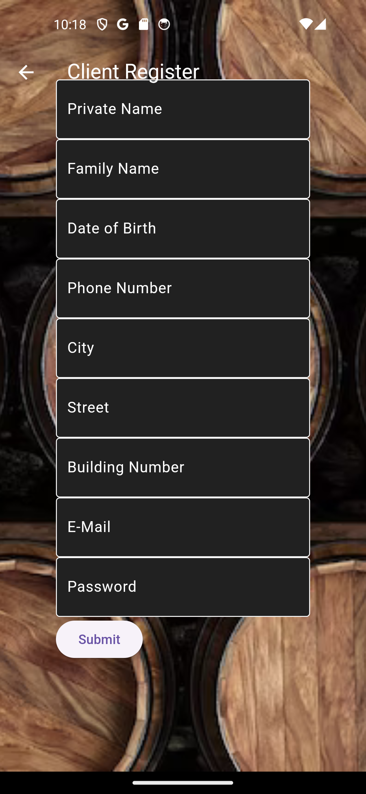

# BarrelSnap: Manage Your Barrels & Discover Craft Wines
**The project were written by:**
- [Yehonatan Friedman](https://github.com/YehonatanFr)
- [Hagay Knorovich](https://github.com/hagayknoro)
- [Daniel Scheniderman](https://github.com/dunisan)
- [Moshe Ofer](https://github.com/mosheofer1)

## Table of Contents

- [BarrelSnap: Manage Your Barrels \& Discover Craft Wines](#barrelsnap-manage-your-barrels--discover-craft-wines)
  - [Table of Contents](#table-of-contents)
  - [About](#about)
  - [Features](#features)
  - [Why BarrelSnap?](#why-barrelsnap)
  - [Getting Started](#getting-started)
  - [For Wineries](#for-wineries)
    - [Barrel Management](#barrel-management)
    - [Business Dashboard](#business-dashboard)
    - [Direct-to-Consumer Sales](#direct-to-consumer-sales)
  - [For Consumers](#for-consumers)
    - [Wine Discovery](#wine-discovery)
    - [Ordering \& Delivery](#ordering--delivery)
    - [Connect with Wineries](#connect-with-wineries)
  - [Screenshots](#screenshots)
  - [Contributing](#contributing)
  - [Tools Used](#tools-used)
  - [Future Work](#future-work)
---

## About
BarrelSnap is a revolutionary mobile application designed to empower wineries and connect them directly with wine lovers who crave unique vintages. We offer a one-stop solution for wineries to seamlessly manage their barrels, from tracking inventory and monitoring aging to scheduling tasks and connecting with potential buyers. For consumers, BarrelSnap opens doors to a curated selection of exceptional wines crafted by passionate winemakers who utilize our barrel management tools.

## Features

- **Effortless Barrel Management:** Wineries can track every stage of their barrel journey, from grape variety and vintage year to aging conditions and scheduled tasks. Get real-time alerts for key activities like topping and racking, ensuring optimal barrel care.
- **Streamlined Workflow:** Simplify your operations with intuitive inventory management, task scheduling, and reporting. Ditch spreadsheets and embrace digital efficiency.
- **Direct-to-Consumer Sales:** Reach a wider audience of passionate wine lovers through our built-in marketplace. Showcase your wines, tell your story, and build relationships directly with potential buyers.
- **Enhanced Communication:** Interact directly with potential buyers in real-time, answer questions, and build loyalty through personalized interactions.
- **Unparalleled Wine Selection:** Consumers discover a curated collection of unique wines from passionate winemakers who utilize our barrel management tools. Support independent producers and explore hidden gems you won't find anywhere else.
- **Personalized Wine Discovery:** Leverage advanced search and filtering tools to find the perfect wine for any occasion, whether you're a seasoned connoisseur or just starting your wine journey.
- **Convenient Ordering & Delivery:** Seamlessly place orders directly from the app, choose your preferred delivery or pickup option, and enjoy exclusive offers directly from wineries.

## Why BarrelSnap?

**For Wineries:**

- **Save time and resources:** Automate barrel management tasks and gain valuable insights into your inventory.
- **Reach new customers:** Connect directly with passionate wine lovers seeking unique and authentic wines.
- **Build brand loyalty:** Engage directly with consumers, answer questions, and build lasting relationships.
- **Streamline operations:** Simplify your workflow and gain control over your inventory management.

**For Consumers:**

- **Discover exceptional wines:** Explore a curated selection of unique wines crafted by passionate winemakers.
- **Support independent producers:** Find hidden gems and champion small-batch wineries.
- **Find your perfect bottle:** Use advanced search and filtering tools to match your taste and occasion.
- **Connect with the makers:** Learn about the stories and philosophies behind the wines you love.
- **Convenient ordering:** Enjoy seamless ordering and delivery options directly from the app.

## Getting Started

1. Clone this repository to your local machine.
2. Install Flutter and Dart SDK.
3. Set up a Firebase project and configure authentication and Firestore database.
4. Update Firebase configuration in the project.
5. Run the app on your preferred emulator or physical device.

## For Wineries

### Barrel Management

- Track inventory, monitor aging conditions, and schedule tasks all in one place.
- Receive timely alerts for key activities like topping and racking.
- Generate reports to gain insights into your barrel data.

### Business Dashboard

- Manage your wine inventory, track sales, and update your profile information.
- Add new wines, update listings, and remove items as needed.
- View and manage incoming orders from clients.

### Direct-to-Consumer Sales

- Showcase your wines and tell your story to a wider audience.
- Interact with potential buyers in real-time and answer their questions.
- Process orders efficiently and communicate updates directly with clients.

## For Consumers

### Wine Discovery

- Explore an extensive wine catalog featuring diverse regions, varietals, and price ranges.
- Use search and filter tools to find wines based on your preferences.
- Discover new favorites by reading tasting notes, ratings, and reviews.

### Ordering & Delivery

- Place orders directly from the app and choose your preferred delivery or pickup option.
- Enjoy seamless ordering and delivery options directly from the app.
- Track your orders and receive notifications on delivery status.

### Connect with Wineries

- Follow your favorite wineries and stay updated on their latest releases and events.
- Engage with winemakers, ask questions, and participate in virtual tastings and events.
- Receive personalized recommendations based on your preferences and purchase history.

## Screenshots

   

## Contributing

We welcome contributions from the community to help improve BarrelSnap. If you have any ideas, suggestions, or bug fixes, please feel free to submit a pull request or open an issue on our GitHub repository.

## Tools Used

- **Flutter:** Framework for building cross-platform mobile applications.
- **Firebase Firestore:** Cloud-based NoSQL database for storing app data in real-time.
- **Firebase Authentication:** Provides backend services for user authentication and authorization.

## Future Work

- **UI Improvement and Optimization**
- **New Features/Functionalities**
- **Generalization for Flexible Usage**
- **Login with Google account**

